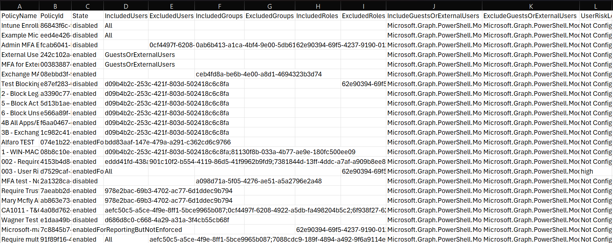

# Conditional Access Policy Report

PowerShell tool that exports Microsoft Entra Conditional Access (CA) policies to a structured CSV report using Microsoft Graph.

This project was developed during my Cloud Identity Consulting internship to improve visibility into Conditional Access configurations and reduce the need for manual review in the Entra ID portal.

---

## What this project does

- Authenticates to Microsoft Graph using delegated permissions
- Retrieves all Conditional Access policies in a tenant
- Extracts key policy metadata, conditions, and enforcement controls
- Outputs a clean, analysis-ready CSV file for Excel or Power BI

This allows consultants and administrators to quickly review policy scope, risk conditions, and grant/session controls without clicking through each policy individually.

---

## Technologies used

- PowerShell
- Microsoft Graph PowerShell SDK
- Microsoft Entra ID (Conditional Access)
- CSV / Excel-based reporting

---

## Key features

- Policy name, ID, and state (On / Off / Report-only)
- Included and excluded users, groups, and roles (counts only)
- User risk, sign-in risk, and insider risk conditions
- Location and client app conditions
- Grant controls (MFA, Terms of Use, custom factors)
- Session controls (sign-in frequency)

---

## Files in this repository

- `Export-ConditionalAccessPolicies.ps1`  
  PowerShell script that connects to Microsoft Graph and generates the report.

- `sample_output.csv`  
  Example output generated during my internship.  
  Actual output will vary depending on tenant policies and permissions.

---

## Notes

- This script is intended for reporting and analysis purposes.
- Sample output is included for demonstration since tenant access and policies may change over time.

---

## Sample Output Preview

